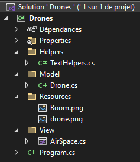

# Semaine 3

## Objectifs de la semaine

- Passer des tableaux aux listes
- Unboxing de la base de code du Drone graphique (winforms)
- Principes d'un moteur de jeu
- Exceptions

## Evaluation

- Check #2 (windows forms)
- Correction ensemble

## Des tableaux aux listes

- On procède ensemble au passage de drone(s) simple(s) à un tableau de drones
- On voit la [théorie des listes](../supports/Listes.pdf)
- Vous faites "voler" une flotte, c'est-à-dire que vous faites voler chaque drone d'une liste
- Et maintenant on va pouvoir ranger le drone console et passer à la suite

## Drone graphique

- Vous reprenez le .ZIP qui est dans les [assets](../exos/Drones/assets) de l'exercice et extrayez son contenu dans un dossier `drones` de votre dossier personnel.
- On passe en revue la structure de la solution VS:  

- On discute des classes `Drone` et `AirSpace`, ainsi que du programme principal.  
- On lit ensemble la consigne de l'[étape 01](../exos/Drones/etape01.md)  
- Vous faites l'étape 01.

## Exceptions

- On étudie ensemble le [support de cours](../supports/Exceptions.pdf)
- Vous mettez en pratique:
    - Supprimez l'initialisation et le passage de la liste de drones dans `program.cs`
    - Initialisez la flotte de drones dans le constructeur. Elle doit être vide.
    - Ajoutez une méthode dans AirSpace qui permet d'ajouter un drone
    - Créez un drone avec des caractéristiques aléatoire et passez-le à `AirSpace`
    - Créez une dizaine d'autre drones de la même manière.
    - Servez-vous des exceptions pour éviter le collisions au démarrage: si on donne à `AirSpace` un drone qui est trop proche d'un autre, la méthode va lancer une exception

## Bilan
